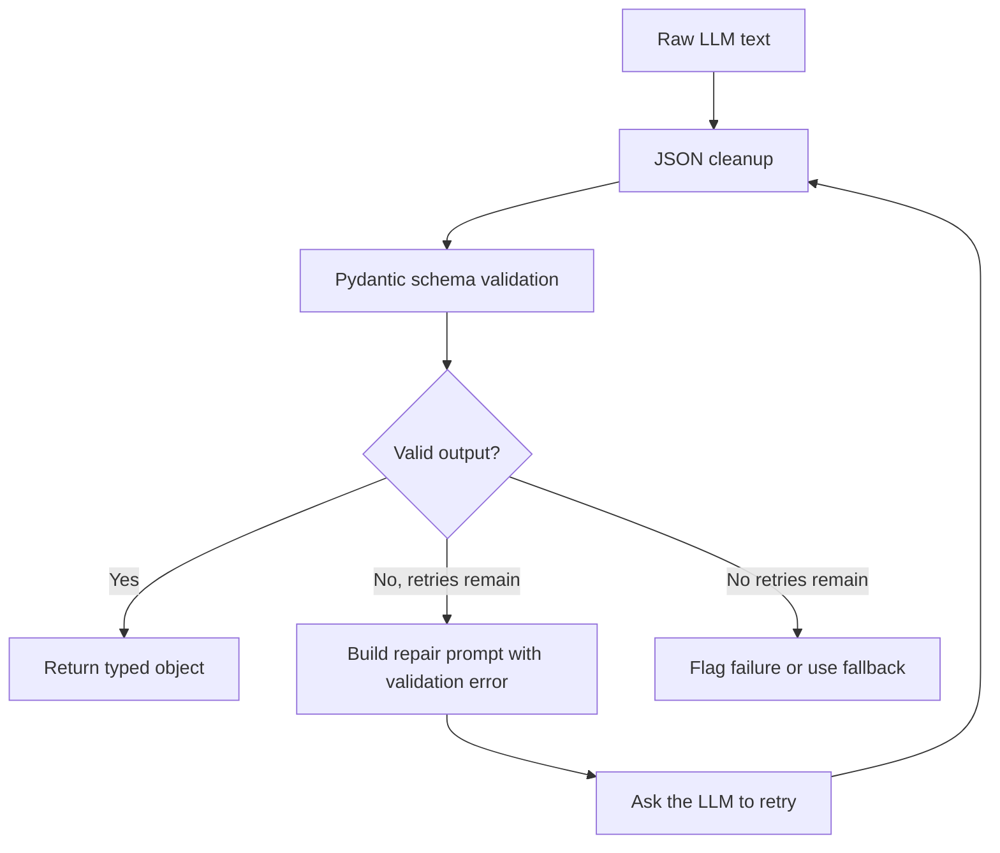
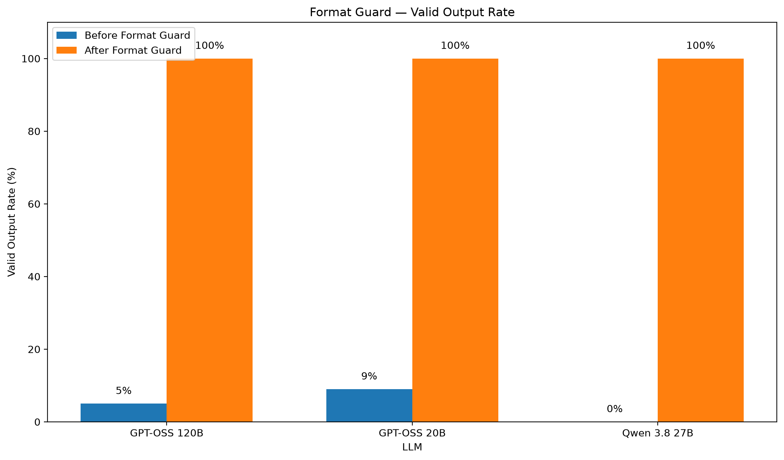

<div align="center">

# Format Guard

Validate and repair LLM output before your application depends on it.

</div>

<!-- TODO: confirm PyPI publish -->

```bash
pip install format-guard
```

<div align="center">

<!-- TODO: confirm PyPI publish -->

[](https://pypi.org/project/format-guard/) · [](https://pypi.org/project/format-guard/) · [](LICENSE) · [](tests/) · [](https://github.com/Mainak156/FormatGuard/stargazers)

</div>

**Contents:** [Quick start](#quick-start) · [Features](#features) · [Benchmark](#benchmark-results) · [Integrations](#integrations) · [Contributing](#contributing) · [Roadmap](#roadmap) · [License](#license) · [Author](#author)

## The problem

LLMs can return information in a format your application cannot safely consume. For example, the model may return `"age": "twenty one"` when your schema requires an integer. Format Guard validates the response, asks the model to repair invalid output, and returns a typed object when validation succeeds.

```json
{"age": "twenty one"}
```

becomes:

```python
Person(age=21)
```

## Quick start

```python
from pydantic import BaseModel
from format_guard import guard

class Person(BaseModel):
    age: int

responses = iter(['{"age":"twenty one"}', '{"age":21}'])
result = guard(schema=Person, llm_fn=lambda _: next(responses),
               prompt="Extract the person's age.", max_retries=1)
print(result.value)
```

## How it works



## Features

- 🧩 **Schema validation:** Use a Pydantic model as the contract for LLM output.
- 🛠️ **Automatic repair:** Retry with the invalid output and validation error.
- 🧹 **JSON cleanup:** Normalize Markdown code fences and trailing commas.
- 🔁 **Bounded retries:** Choose how many repair attempts to allow.
- 🛟 **Fallbacks:** Optionally return a predefined object after retries are exhausted.
- 📊 **Observability:** Inspect attempts, repairs, validation failures, repair rate, and fallback usage.
- 🔌 **Provider-agnostic:** Connect a provider with a callable that accepts a prompt and returns text.

## Benchmark results

In this benchmark, Format Guard raised valid output rates from 0–9% to 100% across the three tested models.

| Model | Before | After | Improvement | Avg. Retries | Repair Rate | Flagged | Extra Cost |
|---|---:|---:|---:|---:|---:|---:|---:|
| GPT-OSS 120B | 5% | **100%** | **+95 pp** | 0.95 | 95% | 0 | $0.028606 |
| GPT-OSS 20B | 9% | **100%** | **+91 pp** | 0.91 | 91% | 0 | $0.013078 |
| Qwen 3.8 27B | 0% | **100%** | **+100 pp** | 1.00 | 100% | 0 | $0.115355 |



> **Limitation:** These results are benchmark-specific. They should not be interpreted as a universal statement about the tested models on arbitrary production prompts. The benchmark intentionally evaluates raw responses before provider-native structured-output enforcement.

## Integrations

<details>
<summary>Groq</summary>

Set `GROQ_API_KEY` in your environment and pass your Pydantic model as `YourModel`:

```python
from format_guard import guard
from format_guard.providers import GroqProvider

provider = GroqProvider(model="openai/gpt-oss-120b")
result = guard(schema=YourModel, llm_fn=provider,
               prompt="Extract the requested information.", max_retries=3)
```

</details>

<details>
<summary>LangChain structured output</summary>

Pass your Pydantic model as `YourModel`:

```python
from format_guard.providers import LangChainGroqProvider

provider = LangChainGroqProvider(model="openai/gpt-oss-120b")
value = provider.generate_structured(prompt="Extract information.", schema=YourModel)
```

</details>

<details>
<summary>REST API</summary>

With the `[api]` extra installed, start the server:

```bash
uvicorn format_guard.api:app --reload
```

Endpoints: `GET /health` and `POST /validate`.

</details>

## Optional extras

```bash
pip install "format-guard[groq]"
pip install "format-guard[langchain]"
pip install "format-guard[api]"
```

## Contributing

```powershell
git clone https://github.com/Mainak156/FormatGuard.git
cd FormatGuard
python -m venv .fguard
.\.fguard\Scripts\Activate.ps1
python -m pip install -e ".[dev]"
python -m pytest -v
```

Please add tests for behavioral changes.

<details>
<summary>Run the benchmark</summary>

```powershell
python benchmarks\run_full_benchmark.py
python benchmarks\generate_report.py
```

</details>

## Roadmap

- [ ] Add more independent LLM providers
- [ ] Reach the roadmap target of 6+ LLMs
- [ ] Add richer failure categories
- [ ] Add latency measurements
- [ ] Add confidence intervals
- [ ] Add GitHub Actions CI
- [ ] Publish stable releases to PyPI
- [ ] Integrate Format Guard into larger agent workflows

## License

MIT License. See [LICENSE](LICENSE).

## Author

**Mainak Sen**

AI/ML Developer focused on LLM applications, agent reliability, evaluation, and production-oriented AI systems.

GitHub: [Mainak156](https://github.com/Mainak156)

LinkedIn: [techmainak001](https://www.linkedin.com/in/techmainak001)
